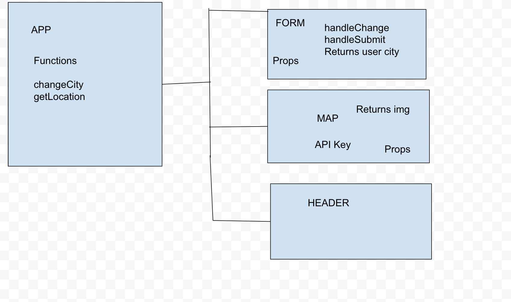
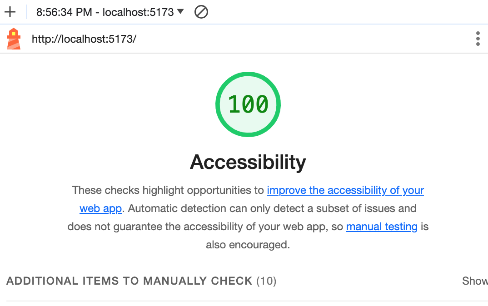

# City Explorer

**Author**: Negin Koushkakinejad
**Version**: 1.0.0 (increment the patch/fix version number if you make more commits past your first submission)

## Overview

The goal is to enhance the city experience by offering a convenient tool for residents and visitors to easily discover and navigate through streets, landmarks, and attractions.

## Getting Started

Environment Setup:
Install an IDE.
Setuped a backend language and frontend framework.
Database:
Chose and setuped a database system.
APIs and Libraries:
Integrated mapping APIs and frontend libraries.
Backend:
Developed backend functions for authentication, data storage, and logic.
Frontend:
Created a responsive user interface and connect it to the backend.
Authentication:
Implement a secure user authentication system.
Testing:
Test thoroughly for functionality and compatibility.
Deployment:
Choose a hosting solution and deploy the app.
Documentation:
Create clear documentation for code and deployment.

## Architecture

The application, named City Explorer, is designed as a React application. It utilizes Axios for handling API requests and Bootstrap for styling. The project is version-controlled using Git, with a repository created on GitHub. The application is deployed on Netlify for live preview during development.

## Change Log

- 12-04-2023 01:30pm - Created a new GitHub repository, city-explorer, with no initial files.
- 12-04-2023 01:35pm - Initialized a new React application named city-explorer locally.
- 12-04-2023 01:50pm - Added a .gitignore file with React configurations, including ignoring of .env.
- 12-04-2023 01:55pm - Connected the GitHub repo to the local repo.
- 12-04-2023 02:00pm - Converted the README.md file to documentation reflecting the lab's current state.
- 12-04-2023 02:10pm - Created a package.json file with dependencies (Axios and Bootstrap).
- 12-04-2023 02:20pm - Deployed the application to Netlify.
- 12-04-2023 03:00pm - Created a PR for the basic React app to the main branch with Netlify Deploy Preview.
- 12-04-2023 03:15pm - Procured a LocationIQ free-tier account and updated API token settings.
- 12-04-2023 03:30pm - Added .env file for API key in local development and Netlify deployment.
- 12-04-2023 04:00pm - Built a form to collect a city name from the user with a "Explore!" submit button.
- 12-04-2023 04:15pm - Used form data to query LocationIQ for city latitude and longitude.
- 12-04-2023 04:45pm - Updated the page with display_name, latitude, and longitude in a Bootstrap component.
- 12-04-2023 05:15pm - Created a Bootstrap component to handle errors with API calls, displaying status code and error message.
- 12-04-2023 05:30pm - Deployed the updated React app to Netlify with error handling.
  

## Credit and Collaborations

Special thanks to Zachary Moore for his collaborations

Name of feature: ____latitude, and longitude in Bootstrap component________________

Estimate of time needed to complete: ___4 hrs__

Start time: _01:30____

Finish time: __05:30___

Actual time needed to complete: ___3 hrs__

A question within the context of this lab assignment:

How was the security of the API key addressed, particularly when incorporating it into the Netlify deployment process?

An observation about the lab assignment, or related ‘Ah-hah!’ moment:

It's notable that the iterative development process, with frequent deployments to Netlify, provides an effective way to visualize and test the application's progress in real-time. This ensures that each feature is functioning as intended before merging into the main branch.

How long you spent working on this assignment:

I spent approximately 5 hours working on this assignment
